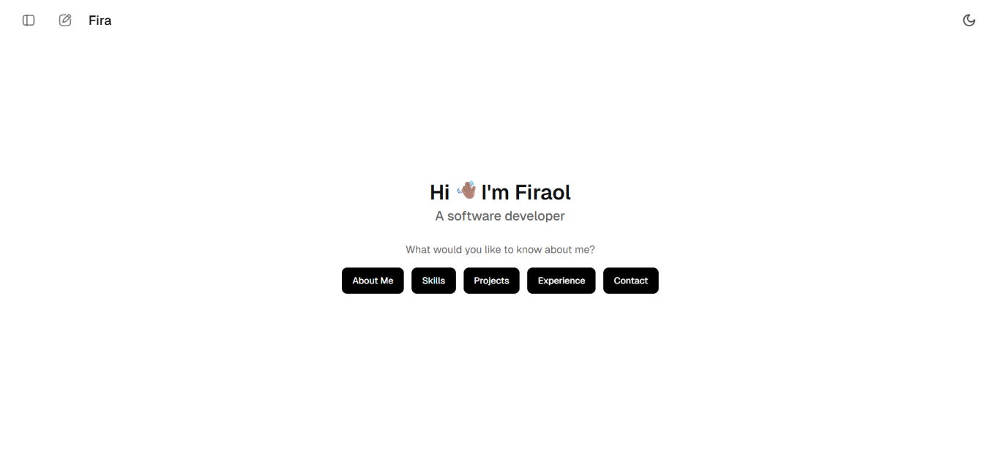

[](https://fira.et)

[](https://app.netlify.com/projects/portfolio-fira-et/deploys)

## 📘 Project Info & How It Works

This project is a personal developer portfolio styled like an LLM (Large Language Model) chat interface - think ChatGPT, but about _you_. It's designed to be more engaging and interactive than a traditional portfolio, letting visitors explore your background through suggestion buttons that stream responses just like an AI assistant.

### ✨ Key Features

- 🧠 **LLM-like Interface** - Visitors interact with your portfolio through buttons like “About Me” or “Projects,” which stream content in a conversational style.
- 🎨 **Markdown-Based Sections** - Each section is written in Markdown and rendered dynamically, making it easy to style and update.
- 🌙 **Dark/Light Theme Toggle** - Theme preference is saved, offering a smooth UX across visits.
- 📱 **Fully Responsive** - Optimized for desktop and mobile screens.
- 🎞 **Hand-Crafted Animations** - Manually created animations enhance transitions and interactions without relying on third-party animation libraries.
- 🔓 **Open Source & Reusable** - Built with customization in mind. Clone it, tweak it, make it yours.

### 🧰 Built With

- [React](https://react.dev/) - UI library
- [Vite](https://vitejs.dev/) - Frontend build tool
- [PNPM](https://pnpm.io/) - Fast, disk space efficient package manager.
- [MUI](https://mui.com/) - Component library and theming
- [Zustand](https://zustand-demo.pmnd.rs/) - State management
- [React Markdown](https://github.com/remarkjs/react-markdown) - Rendering markdown content
- [Netlify](https://www.netlify.com/) - Deployment and hosting

Visit the live website here 👉 [**fira.et**](https://fira.et)

---

## 🧑‍💻 Clone & Customize

Want to use this portfolio for yourself? Feel free - it's open source and easy to personalize!

### 🔧 Setup

1. **Clone the repository:**

   ```bash
   git clone https://github.com/fira-pro/portfolio.git
   cd portfolio
   ```

2. **Install dependencies:**

   ```bash
   pnpm install
   ```

3. **Start the development server:**

   ```bash
   pnpm dev
   ```

### ✨ Customization Guide

#### Personal Info & Behavior Settings

Update `/src/data/constants.js` to personalize the following:

- Your **name**
- **Social links** & **Contacts** (GitHub, Telegram, LinkedIn, etc.)
- **Resume link**, **project URL**
- **Streaming behavior** like delay and typing speed

#### Section Content

All markdown-based section contents (e.g. _About Me_, _Projects_, etc.) are defined in:

```
/src/data/sections.js
```

Each section is stored as a string literal inside an array of objects. Replace the contents with your own markdown to make the site fully yours.

---

## 🤝 Contributing & Issues

Contributions are welcome! Whether it’s fixing bugs, improving accessibility, or adding new features - feel free to open a pull request.

### 🛠 How to Contribute

1. **Fork** the repository
2. Create a new branch:

   ```bash
   git checkout -b feature/your-feature-name
   ```

3. **Commit** your changes:

   ```bash
   git commit -m "Add your message here"
   ```

4. **Push** to your branch:

   ```bash
   git push origin feature/your-feature-name
   ```

5. Open a **Pull Request** explaining your changes

### 🐞 Reporting Issues

If you encounter any bugs or want to suggest a new feature, feel free to open an [issue](https://github.com/fira-pro/portfolio/issues). Please include:

- A clear title
- A short description
- Steps to reproduce (if applicable)

---

## 📬 Contact

Have questions, feedback, or just want to say hi? Feel free to reach out:

- 📧 Email: [hi@fira.et](mailto:hi@fira.et)
- 📱 Telegram: [@fira_pro](https://t.me/fira_pro)
- 💼 LinkedIn: [linkedin.com/in/firaol-debebe](https://linkedin.com/in/firaol-debebe)
- 💻 GitHub: [github.com/fira-pro](https://github.com/fira-pro)

I’m always open to discussing new opportunities, collaborations, or anything cool in the tech world.

---

## 🪪 License

This project is licensed under the [MIT License](LICENSE).  
Feel free to use, modify, and share it - just give credit where it’s due.
